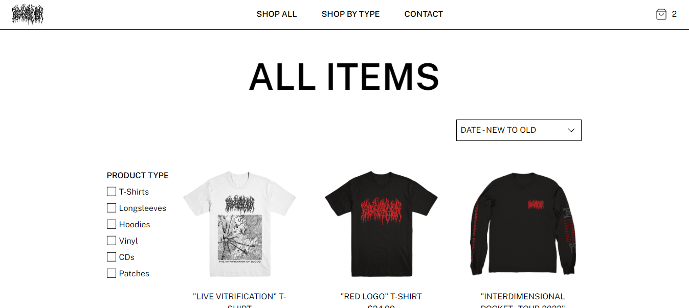

# Blood Incantation Web Store Server

## Table of Contents

- [Overview](#overview)
- [Built With](#built-with)
- [Features](#features)
- [Acknowledgements](#acknowledgements)

## Overview

[Live Demo](https://fakebloodstore.xyz)

This is the Express server I made to process emails and payments for my fake
e-commerce site. I am using Amazon's SES to send contact form and order
confirmation emails to an admin account, and Stripe to process customer payments.

The biggest challenges I faced on this project were deploying to an AWS EC2 and
connecting to the client via HTTPS. I have zero DevOps experience so generating
the SSL certificates on the EC2 took many hours of trial and error. I still
found the experience rewarding and hope to learn more about cloud technologies
on future projects.

I originally tried to implement MailerSend as my SMTP but hit a wall in
their free tier when I deployed to AWS and added a domain name. For anyone
already familiar with AWS, I found SES really easy to use.

### Built With

- [Node.js](https://nodejs.org/en)
- [Express](https://expressjs.com/)
- [TypeScript](https://www.typescriptlang.org/)
- [Amazon SES](https://aws.amazon.com/ses/)
- [Stripe](https://www.stripe.com)

## Features

- Email - Contact form submissions and successful orders generate emails that are
  sent to an admin account.
- Payment processing - Server includes stripe implentation for payment processing.

## Acknowledgements

I learned how to deploy this server with AWS from [this video](https://www.youtube.com/watch?app=desktop&v=nQdyiK7-VlQ&t=1528s) by Sam Meech-Ward.
